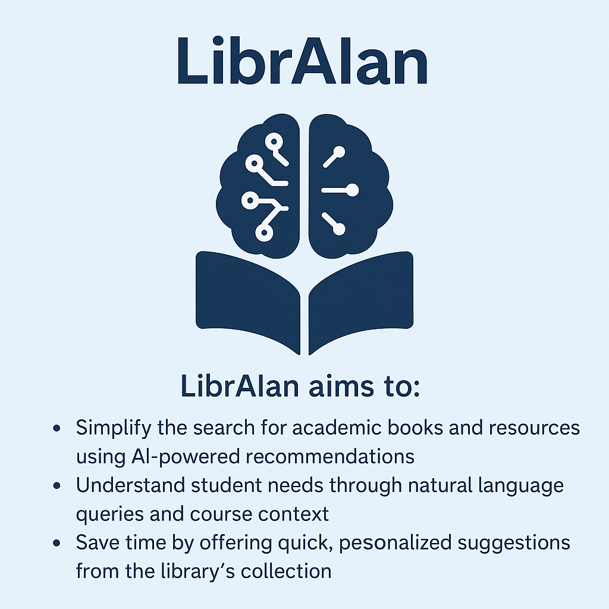
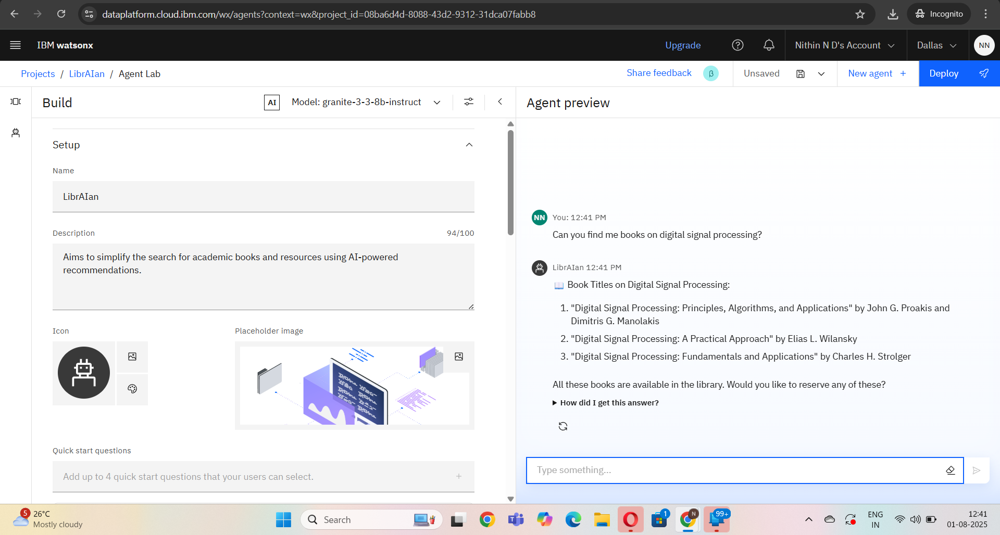
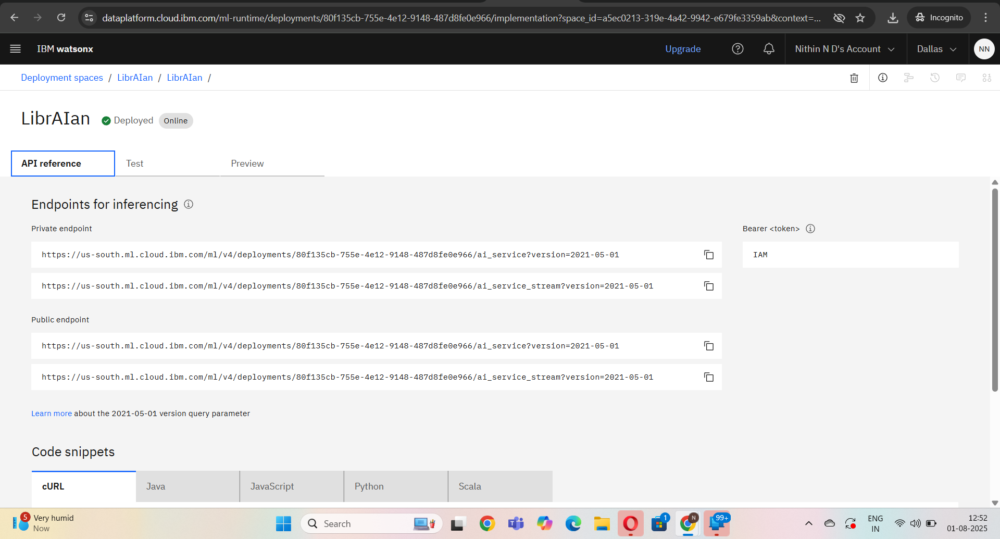
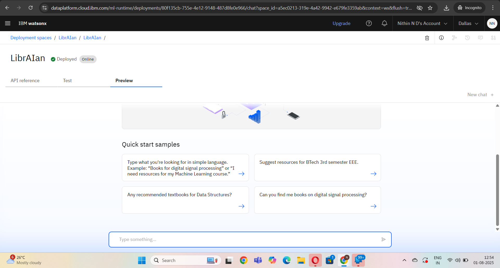

# 📚 LibrAIan – Library AI Agent

An AI-powered assistant designed to help students and faculty find relevant learning materials quickly and intelligently. Built using IBM Watsonx.ai and Retrieval-Augmented Generation (RAG), LibrAIan understands student queries and provides personalized academic book recommendations from a university library database.

---

---

## 🧩 Problem Statement

Students often face difficulties in finding the right academic resources based on their syllabus, topics of interest, or course requirements. Searching through catalogs manually or without proper guidance can lead to wasted time and poor resource utilization.

---

## 💡 Proposed Solution

LibrAIan is an AI agent built on IBM Watsonx.ai that delivers reliable, course-aware, and document-based book suggestions. Using NLP and document retrieval (RAG), it gives grounded recommendations, book availability status, and enables reservation or waitlist actions — all in real time.

---

## 🧠 Technologies Used

- IBM Watsonx.ai Studio
- IBM Granite Foundation Model (LLM)
- Vector Index for RAG
- University syllabus, curriculum, and library metadata (uploaded as PDFs/JSON)
- NLP (Natural Language Processing)
- IBM Cloud Object Storage

---

## ☁️ IBM Cloud Services Used

- Watsonx.ai Studio  
- IBM Granite Model  
- Watsonx Vector Index  
- IBM Cloud Functions  
- IBM Cloud Object Storage  
- IBM Cloud IAM  
- IBM Cloud Lite Account  

---

## 👥 End Users

- University students  
- Faculty members  
- Academic advisors  
- College librarians  
- Course coordinators  
- Self-learners and remote learners  

---

## 🌟 WOW Factors

- Uses RAG to answer based on real syllabus and book metadata  
- IBM Cloud-native and fully scalable  
- Handles unrelated or off-topic questions politely  
- Personalized book suggestions based on course or semester  
- Offers real-time reservation or waitlist options  
- Future-ready with chatbot and voice interface support  

---

## 🧪 Key Features

- Smart academic search via NLP  
- Course-specific and syllabus-aligned book recommendations  
- Live book availability check  
- Reservation and waitlist system  
- Personalized suggestions based on past queries or enrolled courses  
- Off-topic query redirection  
- Real-time chat UI (optional)

---

## 🚀 How It Works

1. User types a query (e.g., “Books for Signals & Systems”)
2. Granite LLM processes the input and identifies intent  
3. Vector Index fetches matching book suggestions from curriculum + library database  
4. LibrAIan checks real-time availability  
5. User is given option to reserve or waitlist  

---

## 🖼️ Screenshots

### 🔹 Testing

### 🔹 API

### 🔹 Deployment

---

## 📌 Sample Questions You Can Ask

- “Books on microprocessors for 3rd semester EEE?”  
- “Is Control Systems by Nagrath available?”  
- “Suggest materials for digital electronics.”  
- “Reserve Python Programming by John Zelle.”  
- “Show top borrowed books for AI.”  

---

## ▶️ How to Run or Deploy

1. Log in to [IBM Cloud Lite](https://cloud.ibm.com)
2. Open **Watsonx.ai Studio**
3. Create a new AI Agent project
4. Upload syllabus PDFs and library metadata to **Vector Index**
5. Configure NLP and retrieval logic using Watsonx tools
6. Set agent behavior (instructions + tone)
7. Test using the preview interface
8. Deploy via embed code or connect to a chatbot frontend

---

## 🛠️ Future Scope

- Integrate with college portal and student login  
- Add voice input and speech output  
- WhatsApp or Telegram chatbot  
- Analytics dashboard for most-searched books  
- Multilingual recommendations using IBM Watson Language Translator  

---

## 🔗 Useful Links

- [IBM Cloud Lite](https://cloud.ibm.com/registration)  
- [IBM Watsonx.ai](https://www.ibm.com/products/watsonx-ai)  
- [GitHub – IBM Developer Repos](https://github.com/IBM)  

---

👨‍💻 Created by **Nithin N D**  
BTech in Computer Science and Engineering  
Presidency University, Bangalore  
